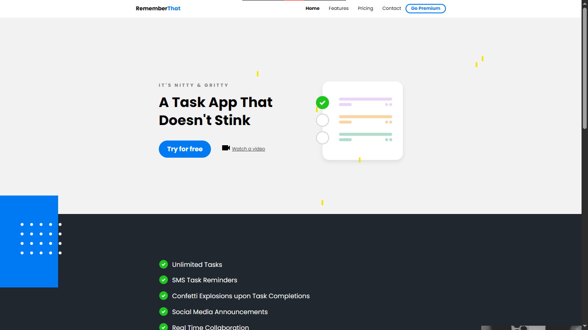

# task-app-website
# Responsive Landing Page

This is a responsive and modern landing page built using HTML, CSS, and SCSS. It includes:
- A hero section
- Features section
- Testimonials
- Contact form
- Responsive navigation

## 🌐 Live Demo
[Click here to view the live site](https://zokomom.github.io/task-app/index.html)

## 📁 Project Structure
* ├── index.html # Main HTML file
* ├── main.css # Compiled CSS file
* ├── main.scss # SCSS source file
* ├── main.css.map # Source map for debugging
* ├── images/ # Folder for images like bullets and icons

# 🛠️ Technologies Used
* HTML5

* CSS3

* SCSS

* Responsive Design

* Google Fonts (Poppins)

# 📸 Screenshots
()

# 👤 Author
* https://github.com/zokomom - Atharv

## Source
* Youtube - DesignCourse
* https://www.youtube.com/@DesignCourse